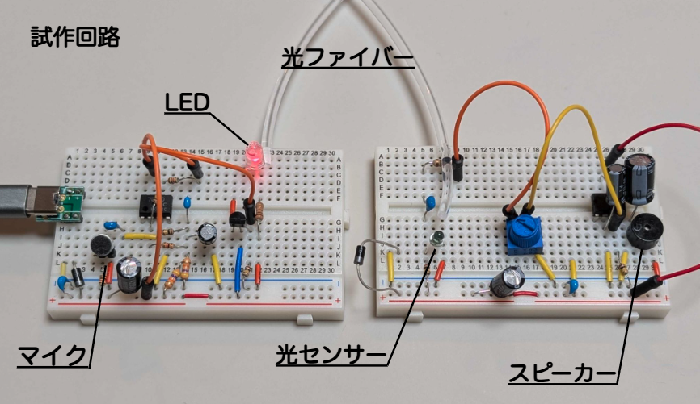
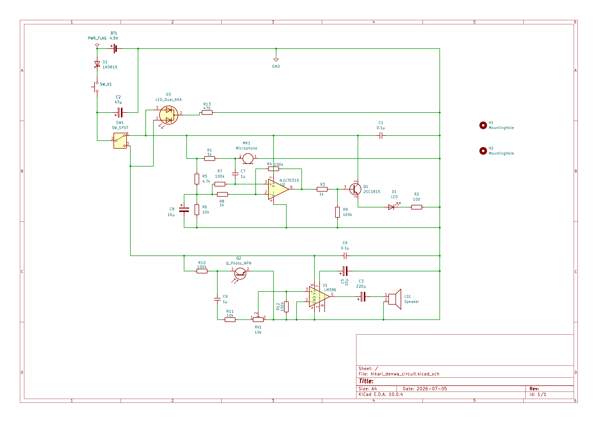
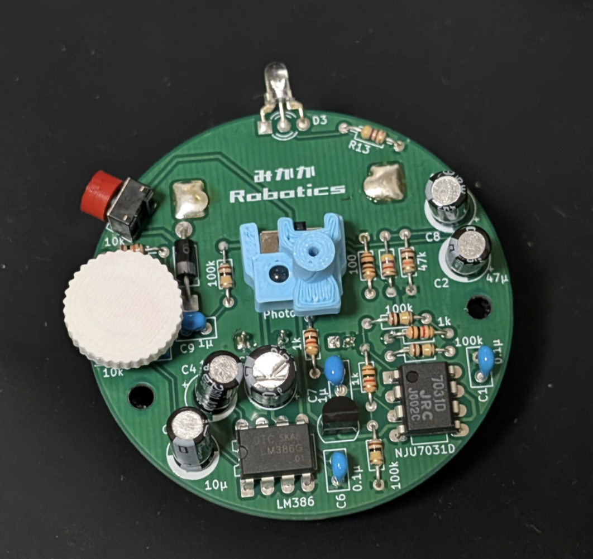

# 光ファイバー糸電話



**普段は目に見えない「通信」を、自分の手で作って体験するための工作キットです。**

マイクに入った声をLEDの光の強弱に変換し、光ファイバーを通して相手側へ送ります。
受信側ではフォトトランジスタで光の変化を受け取り、アンプとスピーカーを使って再び音に戻します。

子ども向け実験教室で、光ファイバー通信の基本的な仕組みを体験してもらうことを目的に製作しました。


## しくみ

通信の流れはシンプルです。

```text
声
 ↓
マイク
 ↓
音声信号を増幅
 ↓
LEDの明るさを変化させる
 ↓
光ファイバー
 ↓
フォトトランジスタで光を検出
 ↓
音声信号を増幅
 ↓
スピーカー
 ↓
声
```

音声をデジタルデータへ変換するのではなく、声の波形に応じてLEDの光量を変化させるシンプルなアナログ光通信です。

## 構成

1台の装置に送信回路と受信回路の両方を搭載します。  



スライドスイッチで使う回路を切り替えて使います。  
また、電池の消耗を抑えるため、プッシュボタンを押された時だけ回路に通電するようになっています。

- **送信側**：ECM → NJU7031D → 2SC1815 → LED
- **受信側**：NJL7502L → LM386 → スピーカー
- **電源**：LR44 × 3
- **通信路**：1 mm PMMA光ファイバー
- **筐体**：3Dプリント部品 + 紙コップ

2台を光ファイバーで接続して使用します。



## 部品表（1台あたり）

以下は **装置1台分** の部品数です。  
2人で通信する場合は、基本的に2台分が必要です。

### 主要電子部品

| 部品 | 用途 | 1台あたり | 購入先 |
| --- | --- | ---: | --- |
| [108182] ECM WM-61A相当品 | マイク | 1 | [秋月電子](https://akizukidenshi.com/catalog/g/g108182/) |
| [102325] NJL7502L | フォトトランジスタ | 1 | [秋月電子](https://akizukidenshi.com/catalog/g/g102325/) |
| [110129] UGCM0903EPD(5.0) | スピーカー | 1 | [秋月電子](https://akizukidenshi.com/catalog/g/g110129/) |
| [114548] LM386G-D08 | 受信用オーディオアンプ | 1 | [秋月電子](https://akizukidenshi.com/catalog/g/g114548/) |
| [113340] NJU7031D | 送信用オペアンプ | 1 | [秋月電子](https://akizukidenshi.com/catalog/g/g113340/) |
| [117089] 2SC1815 | LEDドライバ | 1 | [秋月電子](https://akizukidenshi.com/catalog/g/g117089/) |
| [117244] 1N5819 | ショットキーバリアダイオード | 1 | [秋月電子](https://akizukidenshi.com/catalog/g/g117244/) |
| [106441] OSRBMC3131A | 3 mm 赤・青LED | 1 | [秋月電子](https://akizukidenshi.com/catalog/g/g106441/) |
| [116907] OSY5PA3133A-1MA | 3 mm 黄色LED | 1 | [秋月電子](https://akizukidenshi.com/catalog/g/g116907/) |
| [112723] SS12D01G4 | スライドスイッチ | 1 | [秋月電子](https://akizukidenshi.com/catalog/g/g112723/) |
| [108077] タクトスイッチ（縦型） | 操作用スイッチ | 1 | [秋月電子](https://akizukidenshi.com/catalog/g/g108077/) |
| [106110] 半固定ボリューム 10kΩ | 音量調整 | 1 | [秋月電子](https://akizukidenshi.com/catalog/g/g106110/) |
| [111229] LR44 | 電源 | 4 | [秋月電子](https://akizukidenshi.com/catalog/g/g111229/) |

### 抵抗

| 抵抗値 | 1台あたり | 購入先 |
| --- | ---: | --- |
| 100Ω | 1 | [秋月電子](https://akizukidenshi.com/catalog/g/g116101/) |
| 470Ω | 1 | [秋月電子](https://akizukidenshi.com/catalog/g/g116471/) |
| 1kΩ | 3 | [秋月電子](https://akizukidenshi.com/catalog/g/g116102/) |
| 4.7kΩ | 1 | [秋月電子](https://akizukidenshi.com/catalog/g/g116472/) |
| 10kΩ | 2 | [秋月電子](https://akizukidenshi.com/catalog/g/g116103/) |
| 100kΩ | 5 | [秋月電子](https://akizukidenshi.com/catalog/g/g116104/) |

### コンデンサ

| 容量 | 1台あたり | 購入先 |
| --- | ---: | --- |
| 220µF | 1 | [秋月電子](https://akizukidenshi.com/catalog/g/g110326/) |
| 47µF | 1 | [秋月電子](https://akizukidenshi.com/catalog/g/g117888/) |
| 10µF | 2 | [秋月電子](https://akizukidenshi.com/catalog/g/g117898/) |
| 1µF | 2 | [秋月電子](https://akizukidenshi.com/catalog/g/g115940/) |
| 0.1µF | 2 | [秋月電子](https://akizukidenshi.com/catalog/g/g113582/) |

### 筐体・その他

| 部品 | 1台あたり | 購入先 |
| --- | ---: | --- |
| PMMAサイドグロー光ファイバー 1 mm | 約2 m | [Amazon](https://www.amazon.co.jp/dp/B09X27VDLQ) |
| 電池バネ | 1組 | [Amazon](https://www.amazon.co.jp/dp/B0DJ5D644P) |
| 270 mL ペーパーカップ | 1 | [ダイソー](https://jpbulk.daisonet.com/products/4550480024233) |

## 送信回路の考え方

マイクで拾った小さな音声信号を **NJU7031D** で増幅し、**2SC1815** を介してLEDを駆動します。

LEDを単純にON/OFFするのではなく、声の波形に応じて光量そのものを変化させます。これにより、光ファイバーへ音声情報をそのまま載せています。

## 受信回路の考え方

光ファイバーから出てきた光の変化を **NJL7502L** で電気信号へ戻し、**LM386** で増幅してスピーカーを鳴らします。

受信音量は10kΩの半固定ボリュームで調整します。

